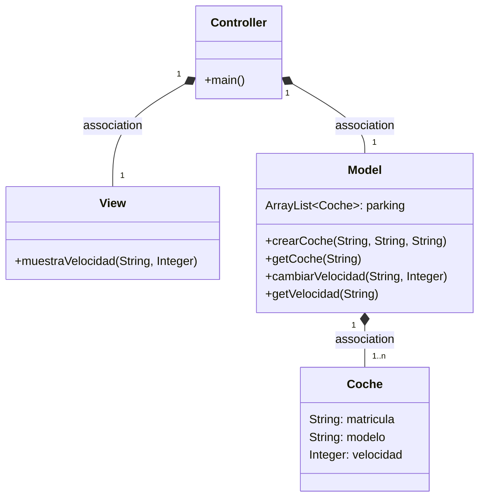
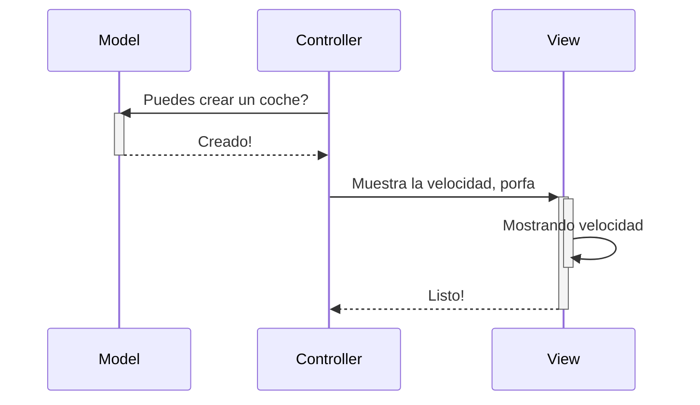
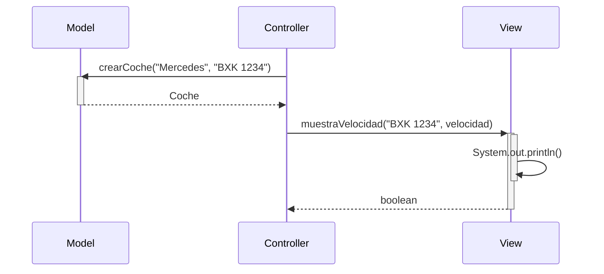

# Arquitectura MVCc

Aplicación que trabaja con objetos coches, modifica la velocidad y la muestra

---
## Diagrama de clases:

---

## Diagrama de Secuencia

Ejemplo básico del procedimiento, sin utilizar los nombres de los métodos

El mismo diagrama con los nombres de los métodos

Diagrama de secuencia:

classDiagram
class Coche {
-String matricula
-String modelo
-Integer velocidad
-double kilometrosRecorridos
-double gasolinaLitros
+Coche(String modelo, String matricula)
+getMatricula() String
+getModelo() String
+getVelocidad() Integer
+getKilometrosRecorridos() double
+getGasolinaLitros() double
+setters() void
}
class Controller {
+main(String[] args) void$
}
class View {
-Scanner sc
+View()
+muestraVelocidad(String matricula, Integer v) boolean
+muestraEstadoAvanzado(String matricula, double km, double gasolina) void
+menu() String[]
}
class Model {
-ArrayList~Coche~ parking
+crearCoche(String modelo, String matricula) Coche
+getCoche(String matricula) Coche
+cambiarVelocidad(String matricula, Integer v) int
+getVelocidad(String matricula) int
+avanzar(String matricula, double metros) boolean
+cargarGasolina(String matricula, double litros) boolean
}
Controller "1" *-- "1" Model : association
Controller "1" *-- "1" View : association
Model "1" *-- "0..n" Coche : association

