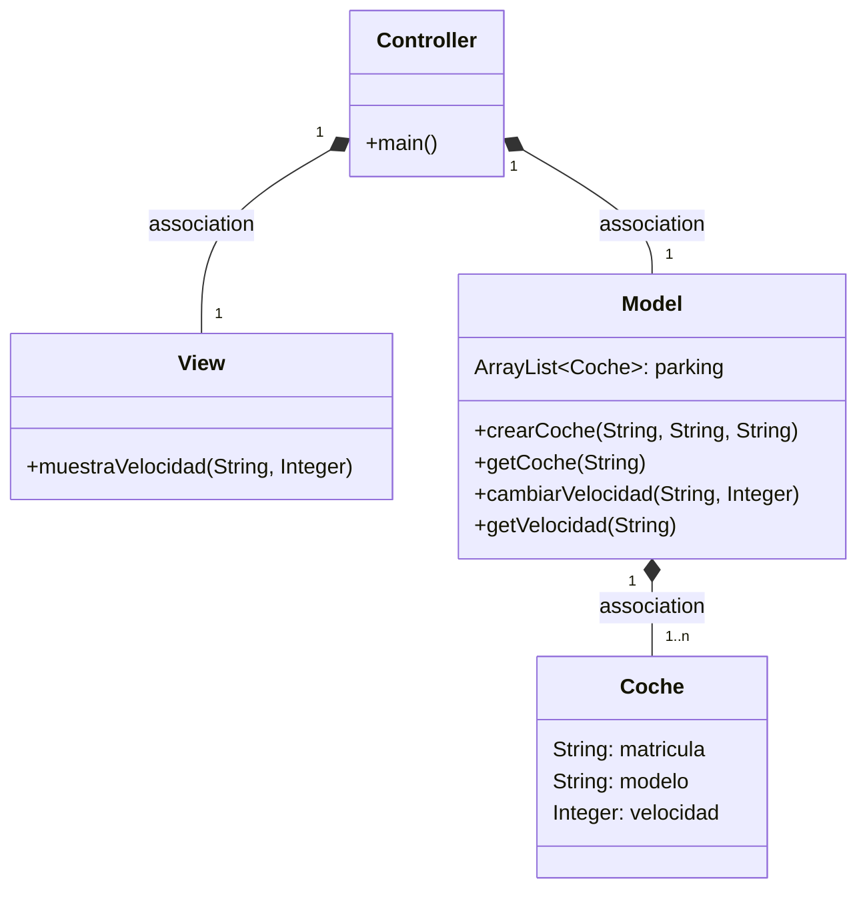
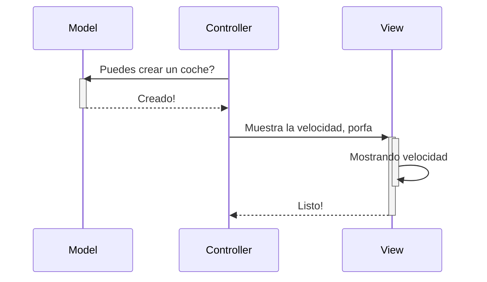
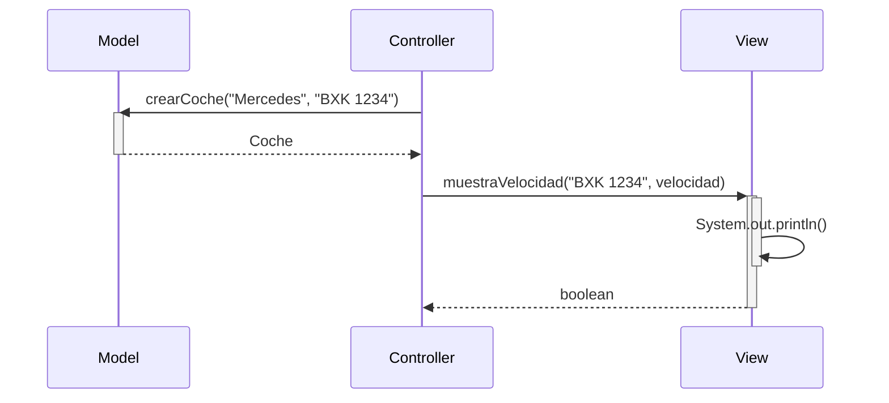

# Arquitectura MVCc

Aplicación que trabaja con objetos coches, modifica la velocidad y la muestra

---
## Diagrama de clases:

---

## Diagrama de Secuencia

Ejemplo básico del procedimiento, sin utilizar los nombres de los métodos

El mismo diagrama con los nombres de los métodos

Diagrama de secuencia:

sequenceDiagram
participant Controller
participant Model
participant View

    Note over Controller: Fase de Inicialización (main)
    
    Controller->>Model: crearCoche("LaFerrari", "SBC 1234")
    activate Model
    Model-->>Controller: aux (Coche)
    deactivate Model

    Controller->>Model: crearCoche("Alpine", "HYU 4567")
    Controller->>Model: crearCoche("Aston Martin", "FGH 3333")

    Controller->>Model: getCoche("SBC 1234")
    activate Model
    Model-->>Controller: ferrari (Coche)
    deactivate Model

    Controller->>Model: cambiarVelocidad("SBC 1234", 30)
    activate Model
    Model-->>Controller: 30 (int)
    deactivate Model

    Controller->>Model: getVelocidad("SBC 1234")
    activate Model
    Model-->>Controller: 30 (int)
    deactivate Model

    Controller->>View: muestraVelocidad("SBC 1234", 30)
    activate View
    View-->>Controller: true (boolean)
    deactivate View

    Note over Controller: Bucle de la aplicación (while)

    loop Ejecución continua
        Controller->>View: menu() [Llamada estática]
        activate View
        View-->>Controller: respuesta (String[])
        deactivate View

        alt respuesta[0] == "c" (Crear Coche)
            Controller->>Model: crearCoche(respuesta[1], respuesta[2])
            activate Model
            Model-->>Controller: aux (Coche)
            deactivate Model
        else respuesta[0] == "v" (Ver Velocidad)
            Controller->>Model: getVelocidad(respuesta[1])
            activate Model
            Model-->>Controller: velocidad (int)
            deactivate Model
            
            Controller->>View: muestraVelocidad(respuesta[1], velocidad)
            activate View
            View-->>Controller: confirmacion (boolean)
            deactivate View
        else respuesta[0] == "s" (Salir)
            Note over Controller: break e indica fin
        end
    end